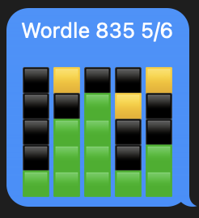

# WORDLE Sheets Loader

## Overview
This project can extract WORDLE scores from an iMessage thread and load them to a Google Sheet.

I started working on this project during the COVID pandemic when some family members and I started playing the [WORDLE (link)](https://www.nytimes.com/games/wordle/index.html) word guessing game. WORDLE is a daily game where the player gets 6 chances to guess a 5-letter word. The WORDLE is the same for everyone on a given day, so sharing the auto-generated spoiler-free results messages can be fun. Some people share their scores on [X/Twitter](https://twitter.com/search?q=%23Wordle&src=typed_query&f=top), but this tool will extract all the WORDLE scores from designated iMessage threads.

There is a Jupyter Notebook that will step you through some required exporatory steps that are needed in order to fill out the `config.yaml` file that is needed to run this tool (e.g. finding the IDs for the iMessage threads in question). Once the `config.yaml` is set up correctly, the `wordle_sheets_loader.py` script can be called from the command line.

## Required Setup
This tool was developed using Mac OS X Ventura 13.5.2 on Apple Silicon (M1 chip) and Python 3.11.5.
* (Optional): If you have [conda](https://docs.conda.io/en/latest/) installed, create a conda environment using the wordle-py-env.txt file:
    * `conda env create --file wordle-py-env.txt`
* (AT YOUR OWN RISK), allow `Full Disk Access` for the Terminal application so Python can read from your local iMessage database:
    * System Settings > Privacy & Security > Full Disk Access > enable Terminal (use `+` icon to add if needed)
    * Confirm you can access the `chat.db` file from Terminal by running `ls -l ~/Library/Messages/chat.db`
    * Add the full file path (`/Users/<username>/Library/Messages/chat.db`) to `config.yaml` under `message_db_path`
* Create a Google Sheet (requires a Google account)
    * [Click here for a link to a Google Sheets template](https://docs.google.com/spreadsheets/d/1EwmcvUiSpH96aSp_1WPyiRNOgkXEi9m7SnZVAY5fHVw/template/preview) > click `USE TEMPLATE` > save a copy in your own account
    * Once you've created your own sheet, copy and paste the `sharing link` into the `sheets_link` value in `config.yaml`
* Create a Service Account to allow access to your Google Sheet
    * The [Authentication section of the gspread docs](https://docs.gspread.org/en/latest/oauth2.html) has good instructions. I opted to create a Service Account and a Service Account key JSON file.
    * Save the JSON file to a safe location on your local system and add the path as the `service_account_key_path` value in `config.yaml`
* Follow steps below to find one (or more) `chat_ids` that correspond to the iMessage threads your WORDLE score messages are in
    * fill in `chat_ids` in `config.yaml`
    * Create entries in `handle_dict` in `config.yaml` to translate phone numbers and/or iMessage email IDs into names
    * Put your own name in the `is_from_me_name` in `config.yaml`

## Score Sheet Screenshot
Here is a screenshot of what the score sheet might look like after loading up a number of scores:

## Potential Future Work
- [x] Break out configuration parameters into a `config.yaml` file
- [x] Add conda env.txt for easier setup
- [ ] Add test code
- [ ] Write a tool to make it easier to point this application at the desired iMessage threads
- [ ] Automate translation of `handle_ids` to contact names by accessing OS X Contacts information

## References
* Article: https://towardsdatascience.com/heres-how-you-can-access-your-entire-imessage-history-on-your-mac-f8878276c6e9
* GitHub code - iMessage DB analysis: https://github.com/yortos/imessage-analysis
* iMessage reader - incl. bytestring decoding: https://github.com/niftycode/imessage_reader
